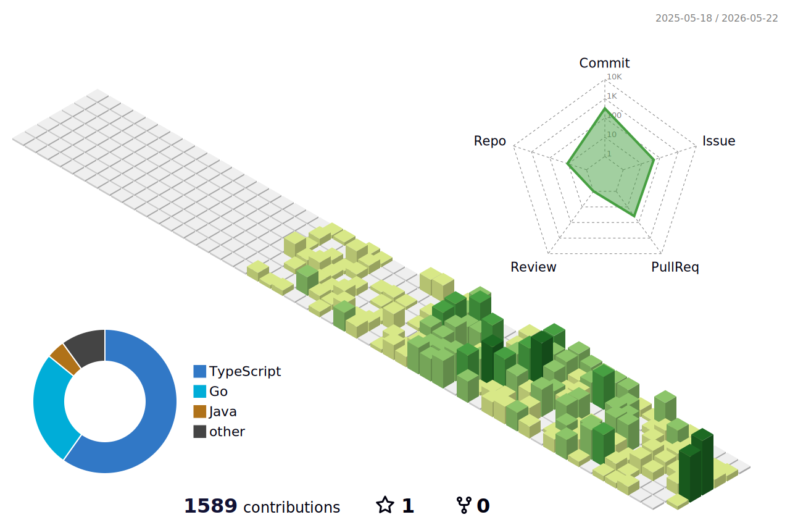

# Hayato Nasu
**Shibaura Institute of Technology** | Information Computer Science & Engineering  
`2028 Graduate` / `Based in Saitama, JP`

---

### Biography
2024年5月より独学を開始。現在はGoとNext.jsを用いたフルスタック開発に注力しています。
大学では低レイヤからアルゴリズムまで、コンピュータサイエンスの基礎を網羅的に学習中。

- **Current:** Developing scalable web applications with Go & Next.js
- **Focus:** Type-safety, Clean Architecture, Performance Optimization
- **Interests:** Distributed Systems, Low-level Programming

---

### Technical Matrix

| Layer | Stack |
| :--- | :--- |
| **Frontend** |    |
| **Backend** |    |
| **Academic** | `C` `C++` `Java` `Python` `Assembly` |
| **Infra/Tools** |    |

---

  

---

### Connect with me

